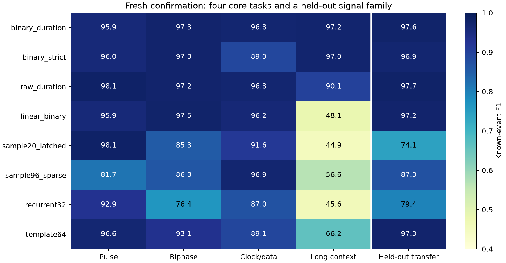

# Temporal waveform recognition experiments

**A comprehensive account of the experiments in `work/study`, reviewed 5 October 2026.**

The temporal waveform recognition study investigates how a configurable receiver can recognize patterns spread across time and reject inputs outside its loaded vocabulary. Its experiments progressed from a small integer reservoir, through controlled memory and topology changes, to explicit sample history and then run-based history. The central finding is that **retaining history, making that history useful to a classifier, and rejecting unfamiliar inputs are three separate problems**. Improving one did not automatically solve the others.

Two advances have fresh confirmation evidence. A 20-sample polynomial memory reached **90.0% known-event F1 and 94.0% unknown-tick recall** on the original pulse-order task. A later 16-run Boolean memory reached **97.0% F1 on a longer context task and 96.9% on a held-out signal family**, using strict run-count checks. Neither is a universal solution: the first has a short memory horizon, while the second trades tolerance of corrupted signals against rejection of malformed bursts. The successful representations are explicit finite-memory filters with nonlinear features, rather than conventional recurrent reservoirs. [1][2]

This report covers both meanings of “shape”: the waveform families presented to the receiver, and the internal arrangements used to remember and classify them. It describes recorded software experiments, not an adopted hardware revision or a completed chip demonstration.

## **Contents**

1. [Purpose and evidence](#purpose-and-evidence)
2. [Waveform shapes](#waveform-shapes)
3. [Experimental method](#experimental-method)
4. [Development history](#development-history)
5. [Reservoir and memory architectures](#reservoir-and-memory-architectures)
6. [Confirmed results](#confirmed-results)
7. [Shortcomings and outright failures](#shortcomings-and-outright-failures)
8. [Hardware implications](#hardware-implications)
9. [Reliability of the evidence](#reliability-of-the-evidence)
10. [Implications for the larger system](#implications-for-the-larger-system)
11. [References](#references)

## **Purpose and evidence**

The larger project is a waveform translator: a host loads settings, the receive side recognizes temporal symbols, and firmware or reflex logic requests output through a separate transmit table and engine. The study addresses the recognition part. It asks whether a useful shape survives in the receiver's state long enough to identify it, and whether unfamiliar shapes can produce class 7 rather than false known symbols. The project doctrine explicitly does not require defeating a conventional decoder on familiar protocols. [3]

The evidence falls into three categories:

| Evidence | What it establishes | What it does not establish |
|---|---|---|
| Development screens and ablations | Which mechanisms helped or failed on inspected data | Fresh performance after architecture selection |
| Frozen confirmation on fresh streams | Performance of the preselected settings on the declared synthetic distributions | Arbitrary protocol recognition or open-world rejection |
| Replay, checkpoints and cold reproduction | Saved behavior can be reconstructed and arithmetic checked | Additional independent statistical evidence, RTL equivalence or physical feasibility |

The report uses local source code, plans, experiment ledgers, saved metrics and verification records. Architectural explanations are tied to those implementations. Where the evidence only suggests a cause, the explanation is identified as an interpretation. Earlier experiments used different held-out seeds; their percentages are not a controlled improvement curve. The two later confirmation studies also have different inputs, framing and metrics, and must be read separately. [1][2][4]

## **Waveform shapes**

### **Pulse order**

The original task distinguishes two high pulses separated by a low gap:

```text
Class 0: high 3 ticks → low 3 ticks → high 8 ticks → idle
Class 1: high 8 ticks → low 3 ticks → high 3 ticks → idle
Class 7: equal high widths of 3, 5 or 8 ticks → unknown
```

The known classes have identical total duration and total high time. Their order distinguishes them. This makes the task a useful memory test: total activity alone is insufficient, and the first pulse must still influence the decision when the second ends.

The most informative comparisons share the final pulse: known `(3,8)` versus unknown `(8,8)`, and known `(8,3)` versus unknown `(3,3)`. A receiver remembering only the ending will confuse them. The experiments repeatedly probe these pairs at four offsets beginning at the final falling edge. [4][5]

**Strength of the task.** It exposes memory loss with short, inspectable counterexamples. A run-length reference also provides a transparent control because the relevant information is exactly two pulse widths and their gap.

**Limitation.** This small vocabulary is not a full protocol. Duration perturbations can also make different intended classes produce identical observed waveforms. For example, with independent ±2-tick width variation, a known `(3,8)` and an unknown `(5,5)` can both produce `(5,6)`. No receiver observing only that waveform can always recover the original label. This follows from the generator's permitted durations; it does not explain every measured error. [4]

### **Biphase and clock/data shapes**

The later suite uses the known six-bit words `001101` and `110001`, with other words assigned to class 7. In the **biphase** family, each bit becomes two opposite three-tick half-cells on one lane, following a common preamble. In the **clock/data** family, one lane carries a low/high clock pair and the other carries the bit value. Both families include shared ending structure, discouraging classification from the final sample alone. [6]

These shapes test ordered codeword recognition and, for clock/data, relationships between lanes. Their weakness as evidence of generality is their fixed vocabulary, nominal timing and observable idle delimiter. The suite does not implement or validate a named biphase standard or SPI mode.

### **Long context and the XOR relation**

The context family contains eight pulse-width bits. A zero is a three-tick high pulse; a one is a six-tick high pulse. Three low ticks separate adjacent pulses. The class is the exclusive-OR of bits 0 and 5: equal markers mean class 0, different markers mean class 1. Bits 1–4 vary without determining the class, and bits 6–7 form a fixed `01` footer. Invalid footers and selected invalid widths are unknown. [6]

This shape tests two requirements simultaneously. The receiver must retain an early marker across unrelated activity, then compare it with a later marker. A linear sum of the two independent marker values cannot represent XOR over all four combinations; a product of signed marker values can represent whether they agree. That gives a concrete reason to test pairwise features instead of merely adding memory slots.

**Strength.** The task separates memory capacity from the ability to represent a relationship. **Limitation.** Its nonlinear relationship is particularly well matched to pairwise features. Success here supports that mechanism for this task, not a general advantage over every other architecture. A small purpose-built counter/FSM could also solve it. [2]

### **Differential transfer shape**

The held-out family uses eight-cell transition words, with known words `10110010` and `01101010`. A one toggles the data lane; a zero holds its level. The starting level is randomized, while the second lane supplies observable activity during the burst. The receiver therefore needs transition history rather than a fixed absolute voltage pattern. [6]

The architecture and adaptation procedure were frozen before fitting this family. It still received its own labeled training and calibration streams. The result demonstrates **transfer of a fixed representation and fitting recipe**, not recognition of a new code without training. The activity lane and idle delimiter remain helpful structure provided by the waveform contract. [2][7]

### **Unknowns and disturbances**

The experiments include equal-width pulse pairs, unfamiliar codewords, invalid footers, unusual marker widths, jitter, sample flips, long idle gaps, midstream startup and dropouts. The later suite additionally tests **prefix splices**: extra activity placed before an otherwise valid-looking suffix. This asks whether finite memory accepts the end of a malformed burst as if it were a complete valid burst.

These unknown sets have different difficulty and evidence status. The later suite's near-matches were excluded from readout fitting but their family informed development. The prefix-splice test was declared before confirmation and kept blind. Neither set exhausts possible unknown waveforms. [2][7]

## **Experimental method**

### **Learning and inference**

Most candidates have fixed internal dynamics or fixed history storage. Only the readout is fitted. The original comparisons attach three readouts to the **same integer reservoir**: Hamming distance to sign-bit prototypes, a ridge-trained linear classifier on those same sign bits, and a ridge-trained linear classifier on full node values. This isolates loss caused by the readout from loss caused by binary state encoding. It is not a comparison between separately implemented spiking LSM and tanh ESN systems. Later broad-search recurrent controls do introduce floating-point tanh dynamics. [4][8]

Training fits weights; validation selects regularization, acceptance thresholds and stabilization. Early unknown examples have all-zero linear targets, with rejection based on score and margin. Later experiments also fit an explicit unknown output. The broad-search ablation finds that this explicit output is not the principal source of improvement. Training occurs offline; inference receives sampled inputs, not labels, clean-waveform annotations or generator boundaries. [1][4]

### **Two different timing contracts**

| Property | Original pulse studies and broad search | Later multi-family suite |
|---|---|---|
| Input | One sampled lane | Two packed sampled lanes |
| Decision opportunity | Continuous per-tick classification | Once a signal-derived idle delimiter is qualified |
| Background | Separate class 2 | No continuous background class at the output gate |
| Target timing | Four ticks starting at intended final falling edge | Intended burst completion |
| Event match window | First six ticks from completion | Completion +8 through +14 ticks |
| Main test perturbations | ±2-tick duration variation and/or 2% sample flips | ±1 tick per generated segment and/or 1% flips per lane, plus additional conditions |
| Unknown metric | Recall on unknown-labeled ticks | Recall of unknown events |

The later front end uses a causal three-sample majority filter and waits for ten consecutive observed `00` samples. It then emits one decision and re-arms on activity. This is substantial deterministic framing logic, not learned synchronization. The longer delay and easier decision timing mean that its pulse F1 cannot be compared directly with the original study's pulse F1. [4][6][9]

### **Metrics and selection**

Event precision measures how many emitted known detections are correct; recall measures how many expected known events were found. F1 balances the two. Unknown recall is reported separately because F1 on known events does not fully characterize rejection. Duplicate, wrong-class and out-of-window known events count against the receiver. Latency describes matched events only; missed events do not become fast detections by disappearing from the latency table.

The early memory follow-ups also require finite initialization forgetting, noncolliding nominal histories, correct probe decisions, and validation precision, recall and unknown recall of at least 80%. A changing state is not sufficient. The protocol suite adds exact four-symbol transaction success, requiring the intended sequence including unknowns and no extra emissions through the following idle interval. These are symbol-list transactions, not complete firmware or transmit transactions. [5][7][10]

## **Development history**

| Stage | Main experiment | Recorded result |
|---|---|---|
| Fixed reservoir | Compare three readouts on seed 23 | Sign representation collapses; full magnitudes retain some information |
| Reservoir selection | Fifteen configurations across seeds 23–25 | `seed24/forward_leak0` avoids collapse but loses required earlier history |
| Mixed leaks | Eight leak assignments on the same topology | Better magnitude memory; no candidate meets all requirements |
| Finite delay chains | Two 16-node chains plus legacy controls | Initialization dependence removed, but horizon and rejection failures remain |
| Broad search | Size, topology, modularity, Boolean dynamics, scalar feedback and polynomial histories | Compact quadratic sample history survives refinement and fresh confirmation |
| Multi-family suite | Four development families and one held-out family | Boolean run memory handles long context; rejection remains a tradeoff |

The broad-search ledger retains **94 development rows**. The later suite retains **196 fitted development models and 852 arithmetic-result rows**: 52 fits/148 rows in screening, 96/464 in refinement, 36/180 in the corrected representation run, and 12/60 in final development. Arithmetic variants and repeated seeds are not independent architecture discoveries. Regression and replay directories preserve earlier behavior rather than adding new recognition claims. [1][7][11]

## **Reservoir and memory architectures**

### **Sparse integer reservoir and sign readouts**

The initial implementation contains 16 signed six-bit nodes. Each node combines retained state, up to three recurrent tap slots, and two input-feature tap slots. The input features encode signed level, signed edge and a coarse logarithmic age since the last transition. Nodes update simultaneously from the previous tick and saturate to the six-bit range. [12]

Conceptually, each update is:

```text
new state = clip(old state − shifted old state
                 + weighted previous neighbor states
                 + weighted current input features)
```

**Positive features.** The state is small, the update is explicit integer arithmetic, and a sign-prototype readout is inexpensive. Comparing three readouts on identical states is a strong diagnostic: changing the classifier cannot disguise a different reservoir.

**Observed failure.** In the fixed seed-23 run, 74.2% of training node samples saturated and all post-startup samples shared one sign fingerprint. Both sign-based readouts produced zero known-event F1. Their 100% unknown recall represented rejection of everything, not successful recognition. Full-state linear inference retained 51.4% F1, showing that some information remained in magnitudes even though the signs had collapsed. [13]

The selector subsequently chose a directed, zero-leak configuration with no saturation and all 16 sign bits varying. On its seed-24 test set:

| Readout | Event F1 | Precision | Unknown-tick recall |
|---|---:|---:|---:|
| Hamming on signs | 25.8% | 17.4% | 2.0% |
| Linear on signs | 39.5% | 25.9% | 73.4% |
| Linear on full states | 49.2% | 33.6% | 0.0% |
| Run-length reference | 75.0% | 94.5% | 87.4% |

Learned weights helped on the same sign representation, and preserving magnitudes helped further. But the selected topology's longest delayed path was only three ticks. With leak shift zero, a node cancels its own carryover. Known and unknown waveforms sharing the ending therefore produced **identical full states** throughout the required decision window. This is a demonstrated information-loss failure: no classifier of that snapshot can recover the missing first pulse. The different test seeds also prevent calling 51.4% versus 49.2% a controlled regression. [4][13]

### **Mixed leak timescales**

This experiment holds connections and weights fixed while changing the 16 leak shifts. Uniform shifts, alternating fast/slow nodes, and repeating cycles of four shifts test whether different retention times can preserve the first pulse.

| Leak assignment | Full-state event F1 | Unknown-tick recall |
|---|---:|---:|
| `uniform0` | 49.3% | 0.0% |
| `uniform1` | 58.7% | 31.1% |
| `uniform2` | 72.0% | 44.1% |
| `uniform3` | 58.2% | 68.8% |
| `alternating02` | 58.5% | 20.4% |
| `alternating20` | 58.8% | 33.7% |
| `cycle0123` | 61.8% | 54.2% |
| `cycle3210` | 81.9% | 52.3% |
| Run-length reference | 78.1% | 87.8% |

All rows use the same seed-104 held-out streams. **No candidate qualified.** [5]

**What improved.** Several assignments preserved nonzero full-state differences across all four nominal decision ticks and all 50 tested continuous prefixes. `cycle3210` also reduced false events substantially relative to the zero-leak control.

**Why it remained inadequate.** All seven nonzero-leak candidates failed the finite initialization screen, retaining residual gaps of 3–39 counts against a permitted maximum of one. Integer shifting can leave small residuals rather than smoothly decaying to zero. More decisively, both cycle variants classified unknown `(8,8)` as known class 0 at every probe decision tick, including after reset. Thus retained differences did not become useful rejection. `cycle3210` recognized only about half the unknown ticks despite its strong known-event F1. No candidate preserved both required distinctions in sign bits at every offset. [5][12]

### **Finite delay chains**

The next experiment replaces the irregular topology with a chain. Node 0 receives an input feature; each subsequent node copies its predecessor's previous value. All leaks are zero. One chain carries signed level minus logarithmic age; the other carries level alone.

**What improved.** Both chains flush arbitrary reservoir initialization within 16 updates under identical input features. Their memory is inspectable: state position `i` contains the input feature from `i` ticks earlier. The age chain retains the required nominal magnitude distinctions, even across different prefixes. [10]

**What failed.** Sixteen positions hold the current feature and only 15 previous ticks. At decision offset `d`, the last sample of the first pulse is:

```text
gap + second-pulse width + 1 + d ticks old
```

For the nominal long-ending pattern, this reaches 15 ticks at the final decision offset. Small duration increases push the information out of the chain. Exact collisions appear within the decision window, including at its beginning for a five-tick gap and ten-tick second pulse. The level-only chain also loses nominal distinctions sooner because a single retained high sample does not encode the first pulse's duration.

The age chain's full-state readout still misclassified unknown `(8,8)` as known even when its magnitude state differed. On seed 105, it achieved 61.3% aggregate F1 and 29.4% unknown recall; the level chain achieved 59.7% and 67.6%. Level-chain Hamming reached 79.3% F1, but did not eliminate its structural collisions. **Neither chain qualified.** Finite memory solved initialization dependence, not sufficient horizon or reliable rejection. [10]

### **Larger and modular recurrent reservoirs**

The broad search adds floating-point tanh reservoirs, with clipped and quantized variants. It tests sparse networks from 8 to 128 nodes; 32-node rings, local and skip connections; and two 16-node modules arranged in parallel, stacked, weakly coupled or input-specialized forms. Some modules also use different leak rates, so those comparisons change timescale as well as arrangement. [8]

**Positive evidence.** A 32-node ring reached 87.7% original validation F1, exceeding the 67.0% result of a 128-node sparse reservoir. Connection structure clearly mattered more than simply increasing the node count in this search.

**Shortcomings.** Parallel, stacked, coupled and specialized 32-node arrangements reached 85.6%, 82.2%, 83.2% and 76.7% on that screen. None established a modularity advantage. The single ring's broader-validation F1 varied from 83.8% to 69.9% and 68.5% across seeds 31–33. Perturbation requirements and, in some rounded-state variants, initialization and probe checks failed. A promising seed did not establish a robust design. [1][8][11]

The later protocol suite uses a separate integer recurrent implementation with 32 total six-bit nodes and single, multiscale or two-module arrangements. Its confirmed multiscale model reaches 92.9% pulse F1 but only 45.6% context F1. Its small readout remains a cost advantage. The mechanism interpretation is that recurrence compresses history economically but did not preserve a reliably usable early-marker relation under these settings; the results do not prove that every recurrent design must fail. [2][9]

### **Boolean cellular dynamics**

The original Boolean experiments use 64 one-bit cells with local update rules 90, 110 or 150, in rings or directed local arrangements. Current input overwrites four injected locations after each update. The later suite revisits 64-cell rings with rules 90 and 30 and two-lane level/edge injection. [9][14]

**Potential benefit.** Boolean local updates offer nonlinear mixing with small state storage and simple operations.

**Observed failure.** The best original screen was the directed rule-90 case at 63.4% F1, compared with 96.9% for 24-sample quadratic memory on the same validation inputs. None passed the nominal decision requirements. Some settings retained initialization differences; others forgot initialization yet still failed classification despite nonzero state distances. In the later refinement, rule-30 context F1 remained about 44.5% with q8 coefficients. These were rejected development candidates, not confirmation winners. [11][14]

Parity-like mixing can react sharply to small perturbations, making it a plausible contributor to poor robustness. That is a mechanism hypothesis, not an established explanation for every error. Also, the later Boolean engines do not use the seed to randomize their fixed rule or injection positions; repeated seed labels do not create independent Boolean topologies. [9]

### **Nonlinear scalar delay feedback**

This family combines a nonlinear scalar update with a buffer:

```text
new = (1 − leak) × previous
      + leak × nonlinear(gain × input + coupling × old buffer tail)
```

The readout sees the full delay buffer. The sweep covers 8–64 stored states, feedback strengths from zero to 0.9, and tanh or sine nonlinearities. [15]

**Potential benefit.** One nonlinear element can drive a larger temporal representation. **Observed failure.** At 32 positions, coupling 0.3 reached 72.6% validation F1, nearly identical to the no-feedback control's 72.5%. Stronger feedback did not establish a benefit, some settings retained initialization differences, and all failed nominal decisions. The full buffer still costs storage; one nonlinear element does not mean one stored state. The bounded sweep found no useful combination of retention, forgetting and rejection. [15]

### **Polynomial sample memory**

The successful original alternative stores recent signed input samples directly, then exposes their pairwise products to a linear readout. With 20 samples, the representation contains 20 linear terms and 190 distinct products, or 210 features. Four fitted outputs score the two known classes, background and unknown. The frozen candidate uses eight-bit coefficients and two-tick stabilization. [1][16]

**Why it helped.** Storage preserves the waveform explicitly, while products expose relationships between times. This separates the memory problem from the feature-expansion problem. A matched development ablation gives 63.2% F1 for linear history and 89.9% for quadratic history. Explicit unknown training changes 89.9% to 90.2% when removed, so it cannot explain most of the gain. Broader timing training contributes a smaller, separately measured improvement from 86.2% to 89.0%. [1]

**Limits.** The horizon remains finite, wider timing variation can erase relevant samples, and the large readout dominates cost. Four-bit coefficient rounding collapses development F1 to 50.7%; six bits reaches 88.8%, and eight preserves the fitted behavior. Changing the input to the older level-minus-age feature reduces development F1 to 71.8%, illustrating that more preprocessing is not automatically more informative. [1][16]

In the later suite, the mechanism is refitted for two lanes and given a causal snapshot at the transition into idle, so waiting for the delimiter does not consume the remaining signal history. It remains excellent on pulses but reaches only 44.9% context F1. A 96-sample, stride-three polynomial control reaches 56.6% context F1 and exceeds the study's parameter budget. More retained time alone did not solve the representation/alignment problem. This does not invalidate the earlier pulse result; it defines its scope. [2][7]

### **Raw duration memory**

Run memory stores completed constant-level intervals rather than every sample tick. A raw entry contains the two lane levels and a duration. The readout uses linear terms, selected cross-run and within-run products, and duration squares. This lets a fixed number of entries cover a much longer waveform than a tick buffer. [9]

**What worked.** In the initial suite screen, 16-run block features reached 87.1% context F1 with floating-point coefficients, versus 47.4% for linear run memory. The smaller block expansion also exceeded the full expansion's 83.9% q12 context result. More features were not automatically better. [7]

**What failed.** Initial eight-bit quantization reduced context F1 to 63.6%, while q12 preserved it at 87.3%. Giving the bias a wider integer representation did not by itself fix raw-duration q8. More seriously, an unfamiliar nine-tick marker extrapolated into a known class: novel context unknown recall was zero. Adding bounds on observed run counts and durations repaired that specific out-of-support failure, but also rejected some noisy known bursts. The guard's gain belongs partly to deterministic support checking, not solely to the learned readout. [7]

The confirmed q12 form remains valuable: 98.1% pulse F1, 96.8% clock/data F1 and 97.7% transfer F1. Its 90.1% context F1 is weaker than binary run memory, but its 95.2% aggregate pulse unknown recall is better than either binary mode's roughly 85%. [2][17]

### **Boolean duration memory and pairwise features**

The strongest tested long-context architecture stores 16 completed runs. Each entry contains two lane bits and three duration tests: `duration > 4`, `duration > 7`, and `duration > 10`. This is **80 payload bits**, with validity handling for unfilled history. The readout receives those 80 values plus 520 selected pair products, giving 600 features. [2][9]

The products connect the same component across runs for both lane bits and the first duration threshold, plus component pairs within each run. Consequently, the representation can expose the agreement or disagreement of separated width markers directly. Bounded binary features also avoid the wide numerical range of raw-duration products.

**What worked.** The linear binary control reaches only 48.1% confirmed context F1; adding pairwise features raises it to 97.2% in relaxed mode. Eight-bit coefficients remain within 0.065 percentage points of corresponding float F1 across confirmed binary tasks/modes. **What did not work.** Reducing to six bits drops a development context result to 60.6%; expanding cross-run pairs to all five components adds cost without a reliable development gain. [2][7]

Two frozen settings expose the central tradeoff. **Strict mode** checks loaded count and duration bounds. **Relaxed mode** keeps duration checks but disables the effective total-count restriction. Both use the same physical representation. Strict mode detects extra activity beyond the retained history; relaxed mode better tolerates spurious runs caused by noise. Their rejection and recall differences are reported below.

### **Conventional and deterministic controls**

The original run-length reference directly retains the two pulse durations and gap. It is perfect on the clean streams in the delay-chain experiment and remains highly precise under perturbation, although it misses more distorted known events than the confirmed polynomial candidate. It shows that the task-defining measurements can be useful without a reservoir. [1][10]

The later suite's generic run-template control stores up to 64 fitted prototypes and uses distance-based acceptance. On pulse confirmation it achieves 100% precision, 93.5% recall and 99.8% unknown recall. It is particularly attractive for a small vocabulary with reliable rejection. Its context F1 is 66.2%, however. The plausible reason is that nuisance variations require more templates while an explicit marker relation generalizes across them. This is not evidence against an optimized dedicated parser: the control is a generic trained matcher. [2]

## **Confirmed results**

### **Original pulse benchmark**

The broad search froze its settings before generating 96 streams across 12 fresh seed blocks. They contain 4,608 patterns, including 3,072 known events. The comparator pool includes 30 rerun historical reservoir/readout combinations. All receivers see identical streams. [1]

| Receiver | Precision | Recall | F1 | Unknown-tick recall | False known events |
|---|---:|---:|---:|---:|---:|
| 20-sample polynomial, q8 | 91.6% | 88.5% | **90.0%** | **94.0%** | 248 |
| Same model, float | 91.5% | 88.3% | 89.9% | 94.0% | 251 |
| Mixed `cycle3210`, full-state linear | 76.1% | 86.4% | 80.9% | 53.0% | 834 |
| Level chain, Hamming | 75.6% | 76.9% | 76.3% | 86.5% | 762 |
| Age chain, sign-linear | 60.1% | 74.2% | 66.4% | 81.1% | 1,514 |
| Original selected, full-state linear | 33.4% | 92.1% | 49.0% | 0.0% | 5,644 |
| Run-length reference | 93.4% | 63.2% | 75.4% | 84.3% | 137 |

The polynomial model improves F1 by about 9.1 percentage points over the strongest legacy receiver, with 70% fewer false known events. The paired empirical bootstrap interval for that F1 gain is +8.56 to +9.90 points at the predeclared 98.333% level. Only one confirmation attempt was used. This is convincing evidence within the declared pulse distribution. [1]

Its aggregate also hides a real boundary:

| Condition | Polynomial q8 F1 | Known recall | Unknown-tick recall |
|---|---:|---:|---:|
| Clean | 100% | 100% | 100% |
| Duration variation | 87.6% | 81.9% | 90.1% |
| Sample flips | 94.4% | 99.7% | 99.0% |
| Both | 77.0% | 72.4% | 87.0% |

Median/p95 matched-event latency is 1/2 sample ticks overall, but 353 known events are missed. A separate post-selection probe of seven unfamiliar pulse pairs yields 83.9% unknown-tick recall and two false known events, both for `(12,3)`. That probe was diagnostic and did not trigger retuning. [1]

### **Multiple waveform families**

The later confirmation contains 280 unique normal streams, 13,400 complete truth events and 822,264 sampled ticks, plus 40 blind splice streams containing 960 unknown bursts. Eight frozen comparisons use three fitted configurations per family and eight stream blocks. Repeated evaluation across fitted models does not multiply the number of independent inputs. [2]

| Architecture | Pulse F1 | Biphase F1 | Clock/data F1 | Context F1 | Transfer F1 |
|---|---:|---:|---:|---:|---:|
| Binary run memory, relaxed | 95.9% | 97.3% | 96.8% | **97.2%** | 97.6% |
| Binary run memory, strict | 96.0% | 97.3% | 89.0% | **97.0%** | 96.9% |
| Raw-duration quadratic, q12 | **98.1%** | 97.2% | 96.8% | 90.1% | **97.7%** |
| Binary run memory, linear | 95.9% | **97.5%** | 96.2% | 48.1% | 97.2% |
| Latched 20-sample polynomial, q8 | **98.1%** | 85.3% | 91.6% | 44.9% | 74.1% |
| Sparse 96-sample polynomial, q8 | 81.7% | 86.3% | **96.9%** | 56.6% | 87.3% |
| Multiscale 32-node recurrent, q8 | 92.9% | 76.4% | 87.0% | 45.6% | 79.4% |
| Up to 64 run templates | 96.6% | 93.1% | 89.1% | 66.2% | 97.3% |



*Saved confirmation figure. High known-event F1 must be read alongside unknown rejection, sequence success and cost.*

Strict binary context F1 has an empirical 95% interval of 96.48–97.52%; transfer has 96.35–97.39%. Relaxed binary improves context F1 over raw-duration q12 by +5.92 to +8.27 percentage points, but its pulse F1 is 1.64–2.89 points worse. This supports a task-dependent tradeoff, not a universally superior architecture. [2][17]

## **Shortcomings and outright failures**

### **Loss of information**

The strongest negative evidence is an exact collision: two inputs needing different answers produce the same state at decision time. This occurs in the selected short-path reservoir and in finite sample chains when earlier evidence falls outside the horizon. Additional fitting cannot repair a collision without changing what information reaches the readout.

Even the confirmed 20-sample model has collisions in 22 of 150 deterministic perturbed memory comparisons at one or more offsets. Its nominal success therefore does not establish collision-free behavior under every allowed perturbation. [1][4][10]

### **Information retained but not used successfully**

Mixed leaks, age chains, Boolean cells and feedback buffers sometimes preserve nonzero state distances yet fail nominal decisions. State separation only says the inputs differ somewhere in the representation. It does not guarantee that the selected linear readout and rejection rule can use those differences robustly. The controlled linear-versus-quadratic experiments are stronger evidence than distance plots alone because they test actual decisions with and without the relevant interactions. [1][5][10]

### **Unknown inputs accepted as known**

| Failure probe | Strict binary | Relaxed binary | Mechanism or supported interpretation |
|---|---:|---:|---|
| Blind prefix-splice rejection | 100% | **0%** | The retained suffix looks valid; only strict total-count checking catches the discarded prefix |
| Pulse near-match unknown recall | 53.1% | 53.1% | Many unfamiliar widths remain inside the accepted feature region |
| Clock/data near-match unknown recall | 53.9% | 53.9% | Legal counts and durations do not prove codeword membership |
| Clock/data recall with glitches | 60.5% | 99.2% | Strict count bounds reject extra observed runs, including those introduced by corruption |
| Clock/data recall with jitter and glitches | 57.8% | 91.9% | Segmentation errors persist after filtering |

The relaxed model's acceptance of **all 960 tested splice bursts** is an outright failure of malformed-prefix rejection. The strict model fixes that finite probe but substantially reduces noisy known-event recall. Both modes reject only about half the tested pulse and clock/data near-matches. Their strong aggregate unknown scores therefore do not establish reliable unknown-pattern handling. [2][17]

Binary duration coding also loses distinctions deliberately: widths three and four, for example, have identical results for all three threshold tests. Such binning can improve tolerance and arithmetic simplicity, but it cannot establish exact duration membership. The measured near-match failures show why support checks and learned scores remain insufficient for unrestricted rejection. [6][9]

### **Quantization and added complexity**

Four-bit polynomial readout coefficients, raw-duration q8 and binary-duration q6 all exhibit severe measured regressions. More state, more recurrent coupling, multiple reservoirs and fuller feature expansions also fail to deliver reliable improvements in the tested comparisons. Each is a rejection of specific settings or a proposed shortcut, not proof that an entire model family is unusable. [1][7][11]

The majority filter is a material contributor. In matched raw-run q12 development configurations, filtering raises pulse F1 from 86.5% to 98.0%, biphase from 81.4% to 96.3%, clock/data from 81.6% to 88.7%, and context from 74.9% to 90.7%. Recognition quality cannot be attributed entirely to reservoir or readout design. [18]

### **Sequence reliability and recovery**

Per-event quality does not translate directly into error-free sequences. Strict binary exact four-symbol transaction success is 82.1% for pulse, 87.0% for biphase, **62.0% for clock/data**, 87.6% for context and 86.9% for transfer. Relaxed clock/data reaches 84.7%. [2]

Recovery also has limits. Strict binary correctly classifies the event immediately after an injected dropout in only 12/24 clock/data evaluations, versus 24/24 pulse evaluations. These counts reuse eight inputs across three fits. Startup fragments cause false known outputs in clock/data and transfer. The receiver has useful recovery behavior, not a guarantee that it can enter an arbitrary stream without mistakes. [2]

### **An experiment infrastructure failure**

The suite's first representation run stopped because resource accounting applied binary feature indices to a raw-duration bound vector. Its exception log is retained, and the corrected run is named `representation_v2`. This was an accounting-code defect caught before freezing, not an accuracy result or evidence against the architecture. Keeping it distinct prevents a failed run from being silently omitted or misclassified as a scientific failure. [7]

## **Hardware implications**

The successful models have small history buffers but substantial classifiers. Counting only “20 samples” or “16 runs” obscures most of their implementation cost.

| Candidate | History and state accounting | Readout and operation accounting |
|---|---|---|
| Original integer/Hamming baseline | 96 reservoir-state bits; excludes surrounding receiver logic | Historical study readout uses 48 bits for three sign prototypes; not a whole-chip count |
| Original one-lane polynomial q8 | 20 sample bits plus 20 conservatively counted startup-validity bits | 6,752 parameter bits; 190 products and 840 coefficient contributions **per tick** |
| Later binary run memory | 80 run payload bits; **158 total estimated recognizer state bits** with parallel readout | **14,512 bits** for a common fixed parameter format; 520 pair operations and 1,800 contributions **per decision** |
| Later raw-duration q12 | 190 estimated state bits | Roughly 17.1 kbit loaded parameters; 472 features |
| Later latched recurrent control | 439 estimated state bits, including retained snapshot/front end | Roughly 1.8 kbit loaded parameters; 32 features, but weak context results |

The categories differ in scope, as labeled; they are not synthesized area comparisons. The three-prototype figure describes the historical study's fitted classes, not the complete released hardware prototype table. Parameter-file minima also differ from the storage a fixed implementation must provision. For example, a template model can load very few entries on the pulse task, but a 64-slot device must reserve 7,552 prototype bits plus control. [1][2][17]

Binary products can use sign logic/XNOR and coefficient sign selection rather than general multipliers. Addition throughput remains significant. The later binary model needs fixed 18-bit scores and 19-bit score differences for the declared coefficient range. With one shared contribution unit, its 1,800 contributions require at least 1,800 compute cycles per decision before additional work. Observed decision gates can be only 11 sample ticks apart, implying at least 164 compute clocks per sample for those contributions alone. Snapshot and serial-accumulator support adds approximately 168 state bits. These are analytical counts, not a demonstrated clock rate. [2]

The suite's measured median/p95 latency is ten sample ticks from intended completion, dominated by filtering and delimiter qualification. From burst start, strict binary medians are 24, 52, 52, 67 and 37 ticks for the five families. Software performs the readout immediately at the gate; these latencies exclude a hardware readout schedule and synchronizer clocks. They do not establish suitability for an immediate protocol reflex. [2]

No study result provides synthesis, post-route timing, measured cell area or proof of fitting the 6×4 tile budget. The suite's 32,768 parameter-bit budget is a research constraint, not a silicon-area conversion. Loader, core, FIFOs, transmit engine and pads remain additional costs. [2][3]

## **Reliability of the evidence**

The strongest experimental practice is the progression from suggestive scores to explicit counterexamples, controlled ablations and frozen fresh confirmation. The mixed-leak and chain experiments keep selection `null` when no candidate qualifies; they do not silently adopt the best failing model. The broad search reruns the legacy comparison pool on identical fresh inputs rather than relying on earlier scores. The later suite preserves per-condition failures and a blind splice test that contradicts a simple success narrative. [1][2][5][10]

Saved verification records support software reproducibility:

- The original polynomial candidate replays all 96 confirmation streams, including states, decisions, events and checkpoint restoration.
- The later suite records an independent nominal audit of 1,920 labels, replay of 7,680 model/stream evaluations, 121,140 scalar gate decisions and 315 checkpointed streams.
- Integer bounds were checked on 282,660 gate score vectors; explicit wrapping 18-bit accumulation reproduced 3,360 vectors for the common binary datapath.
- A cold rerun refitted all 120 final models and reproduced the confirmation predictions and metrics exactly at the same seeds. [1][19]

These are recorded checks, not new tests rerun for this report. The report's numerical tables were checked against the available metrics and analysis artifacts. The cold rerun adds reproducibility, not another independent confirmation population. Neither software replay nor bounded arithmetic checking is formal verification or RTL lockstep.

Remaining limitations include synthetic generators, finite vocabularies, bounded hyperparameter searches, only a small number of independent fitted replicates, and unknown tests that cover selected patterns rather than an open world. The later confirmation's seven conditions are not a full cross-product of all unfamiliar inputs and all noise conditions. Empirical bootstrap intervals quantify variation within the recorded design; they do not remove those scope limits. [1][2][7]

## **Implications for the larger system**

The experiments support three bounded conclusions. **Explicit memory is easier to diagnose than uncontrolled recurrence. Nonlinear features can make retained relations usable. Unknown rejection must be evaluated as a first-class requirement.** The exact collisions, nonlinear ablations and splice tradeoff provide the clearest evidence for those conclusions.

For the original short pulse vocabulary, the confirmed 20-sample polynomial model is a useful software reference. For the tested delimited long-context codes, strict binary run memory is the strongest confirmed candidate when malformed length matters. Raw durations and deterministic templates remain credible alternatives where pulse discrimination, rejection or cost is more important. Relaxed count checking is a conditional choice whose measured acceptance of malformed prefixes must be acceptable to the surrounding framing contract. These are research choices, not released design decisions. [1][2]

The study has not demonstrated the complete load–decode–re-emit path, familiar-protocol firmware coverage, electrical compliance, on-chip training or a gate pass. `knowledgebase/phases.md` still defines the required project artifacts. The receive representation, framing assumptions, study timestamps and hardware scheduling would need explicit integration; the transmit table and engine remain responsible for producing pins, and the core receives no direct pin path. [3]

The narrowest justified follow-up is to address the **strict-count versus noise tradeoff** while preserving blind near-match and malformed-prefix tests. A new mechanism should demonstrate improved rejection and noisy recall on fresh data before its additional cost is accepted. This is a recommendation arising from the recorded failures, not an experiment already performed.

## **References**

[1]: broad_search/REPORT.md
[2]: protocol_suite/REPORT.md
[3]: ../../knowledgebase/doctrine.md
[4]: readout_comparison/README.md
[5]: mixed_leaks/README.md
[6]: protocol_suite/signals.py
[7]: protocol_suite/LEDGER.md
[8]: modular_reservoirs/README.md
[9]: protocol_suite/models.py
[10]: delay_chains/README.md
[11]: broad_search/LEDGER.md
[12]: ../model/reservoir_model.py
[13]: results/latest/metrics.json
[14]: boolean_ca/README.md
[15]: delay_feedback/README.md
[16]: polynomial_memory/README.md
[17]: protocol_suite/artifacts/analysis/tables.json
[18]: protocol_suite/artifacts/refine/summary.json
[19]: protocol_suite/artifacts/verification/replay.json

1. [Broad-search report and fresh pulse confirmation](broad_search/REPORT.md); [confirmation metrics](results/broad-confirmation/20261005T012024.954575Z/metrics.json); [post-selection boundary diagnostic](results/research-report/20261005T012524.648650Z/boundary.json) and [unseen-unknown probe](results/unseen-unknown-probe/20261005T012713.374377Z/probe.json).
2. [Protocol-suite report](protocol_suite/REPORT.md); [full condition tables](protocol_suite/artifacts/analysis/TABLES.md); [uncertainty estimates](protocol_suite/artifacts/analysis/uncertainty.json).
3. [Project doctrine](../../knowledgebase/doctrine.md), [authority](../../knowledgebase/authority.md), and [phase requirements](../../knowledgebase/phases.md).
4. [Readout comparison and selection methods](readout_comparison/README.md); [selected-run metrics](results/selected/metrics.json); [selection audit](results/selected/selection.json).
5. [Mixed-leak methods and results](mixed_leaks/README.md); [saved metrics](results/mixed-leaks-seed24-test104/metrics.json).
6. [Suite waveform generators](protocol_suite/signals.py) and [preregistered contracts](protocol_suite/PLAN.md).
7. [Protocol-suite development ledger](protocol_suite/LEDGER.md), [provenance](protocol_suite/PROVENANCE.md), and [frozen comparison settings](protocol_suite/configs/selection.json).
8. [Size and modularity experiments](modular_reservoirs/README.md); [recurrent implementation](modular_reservoirs/reservoir.py).
9. [Suite front end and feature engines](protocol_suite/models.py); [streaming receiver](protocol_suite/receiver.py); [learning and support checks](protocol_suite/learning.py).
10. [Delay-chain experiment](delay_chains/README.md); [saved metrics](results/delay-chains-test105/metrics.json) and [timing diagnostic](results/delay-chains-test105/timing.json).
11. [Broad-search ledger of all 94 development rows](broad_search/LEDGER.md).
12. [Original integer reservoir, feature extractor and readouts](../model/reservoir_model.py).
13. [Fixed-reservoir metrics and training diagnostics](results/latest/metrics.json).
14. [Boolean cellular experiment](boolean_ca/README.md).
15. [Scalar delay-feedback experiment](delay_feedback/README.md).
16. [Polynomial-memory implementation and ablations](polynomial_memory/README.md); [portable frozen q8 configuration](polynomial_memory/compact_20_q8.json).
17. [Machine-readable suite results](protocol_suite/artifacts/analysis/tables.json), [failure examples](protocol_suite/artifacts/analysis/failure_examples.json), and [hardware accounting](protocol_suite/artifacts/analysis/hardware_accounting.json).
18. [Suite refinement results, including filtering controls](protocol_suite/artifacts/refine/summary.json).
19. [Saved replay verification](protocol_suite/artifacts/verification/replay.json), [fixed-width verification](protocol_suite/artifacts/verification/fixed_width.json), and [cold-reproduction comparison](protocol_suite/reproductions/cold_check/comparison.json).

Historical `results/` artifacts are available in this checkout but are Git-ignored. Their links may be unavailable in a fresh clone; experiment READMEs retain methods, observed summaries and reproduction commands. This report preserves that distinction rather than treating a missing local artifact as a new result.
