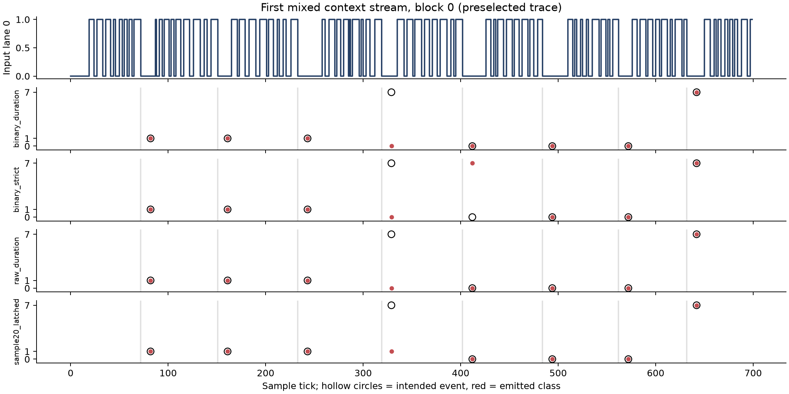
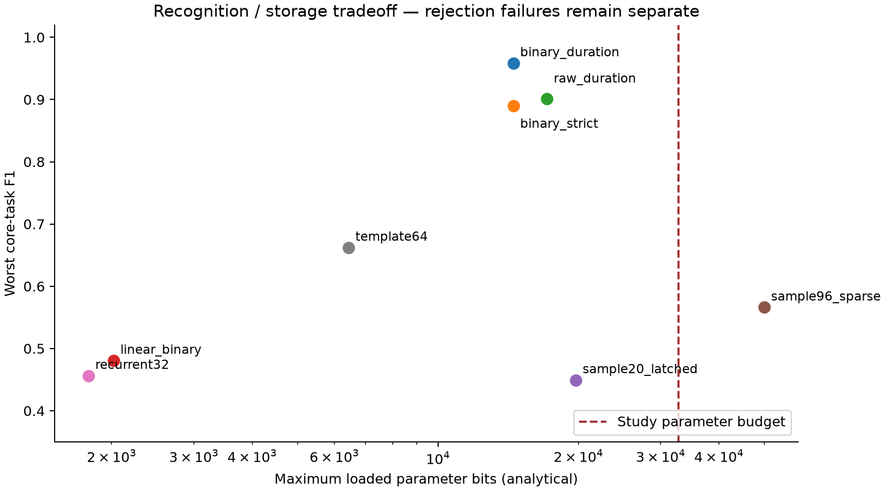

# Result: finite run memory is useful; rejection remains the deciding tradeoff

**The strongest tested long-context representation is a 16-run Boolean memory
with pairwise features and an 8-bit readout. No tested architecture dominates
recognition, unknown rejection, and cost across these formats.**

For the next study implementation, retain this architecture with **strict loaded
run-count bounds** when malformed frames must be rejected. It achieves **97.0%
long-context F1** and **96.9% F1 on the held-out differential-coded family**, and
rejects every tested malformed-prefix splice. Its serious cost is noisy clock/data
recall. Relaxing the count bounds improves that recall, but accepts every splice.
Neither setting reliably rejects all close unfamiliar codewords. This is a
candidate for configured, delimited temporal codes, not a general protocol decoder.

## Fresh comparison

Eight frozen comparisons, three independently fitted configurations per task, and
eight new stream seed blocks. Each block contains all seven conditions. There are
**280 unique continuous streams, 13,400 complete truth events and 822,264 sampled
ticks**, plus 40 separate blind splice streams containing 960 unknown bursts.
The same inputs are shared by every receiver. Repeated fitted-model evaluations
are not counted as additional independent input streams.

Conditions are clean; ±1 tick per generated segment (merged observed runs can
vary more); independent 1% per-lane sample flips; both perturbations; clean
unfamiliar near-matches; idle gaps of 10–80 ticks; and midstream startup plus a
five-tick dropout under both perturbations. This is not a full cross-product of
every unknown pattern and every corruption condition.

| Frozen architecture | Pulse F1 | Biphase F1 | Clock/data F1 | Long-context F1 | Held-out transfer F1 |
|---|---:|---:|---:|---:|---:|
| Binary run memory, relaxed count | 95.9% | 97.3% | 96.8% | **97.2%** | 97.6% |
| Binary run memory, strict count | 96.0% | 97.3% | 89.0% | **97.0%** | **96.9%** |
| Raw run durations, quadratic, q12 | **98.1%** | 97.2% | 96.8% | 90.1% | 97.7% |
| Binary run memory, linear control | 95.9% | 97.5% | 96.2% | 48.1% | 97.2% |
| 20-sample polynomial, latched, q8 | **98.1%** | 85.3% | 91.6% | 44.9% | 74.1% |
| 96-sample sparse polynomial, q8 | 81.7% | 86.3% | 96.9% | 56.6% | 87.3% |
| 32-node multiscale recurrent, q8 | 92.9% | 76.4% | 87.0% | 45.6% | 79.4% |
| Deterministic run templates, up to 64 | 96.6% | 93.1% | 89.1% | 66.2% | 97.3% |

The 96-sample polynomial exceeds the 32,768-bit parameter budget. Full precision,
quantized, Boolean-CA, single/multiple-timescale, modular, size and feature ablations
are retained in the [ledger](LEDGER.md). The original one-lane polynomial weights
were not reused as if they were universal: its mechanism was refitted under the
new common two-lane/framing contract. A falling-to-idle snapshot prevents the
ten-tick delimiter from unfairly consuming its active-signal memory.

The paired empirical 95% interval for the relaxed binary model's **context gain
over raw-duration q12 is +5.92 to +8.27 percentage points**. Its macro core-task
gain is +0.82 to +1.60 points, while pulse F1 is **1.64–2.89 points worse**.
Strict binary context F1 has interval **96.48–97.52%**; transfer F1 has interval
**96.35–97.39%**. These are 10,000 paired resamples of three fitted-model replicates
and eight stream blocks, not tick-level confidence intervals or guarantees about
other signal populations. Secondary intervals are descriptive; no simultaneous
multiple-comparison coverage is claimed. See [uncertainty.json](artifacts/analysis/uncertainty.json).

## Failures that aggregate F1 conceals

| Probe / condition | Strict binary | Relaxed binary | Consequence |
|---|---:|---:|---|
| Blind prefix-splice unknown rejection | **100%** | **0%** | Truncated history can accept a valid-looking suffix of a malformed burst. |
| Clock/data with glitches: known recall | **60.5%** | **99.2%** | Extra observed transitions violate strict run counts. |
| Clock/data with jitter + glitches: known recall | **57.8%** | **91.9%** | Filtering and permissive duration bounds do not remove all inserted runs. |
| Unfamiliar pulse near-matches: unknown recall | **53.1%** | **53.1%** | The learned acceptance region is broader than the loaded codebook. |
| Unfamiliar clock/data near-matches: unknown recall | **53.9%** | **53.9%** | Correct length and legal durations do not establish codeword membership. |
| Long context with jitter + glitches: known recall | **83.2%** | **85.3%** | Corrupted event segmentation still damages history. |

The blind splice probe was specified before confirmation and never used to retune.
Strict rejection held for all five families, 192 unique splice bursts each. This
is a finite probe set, not an open-world guarantee. The seven ordinary conditions
have separate aggregate accounting; splice failures were not averaged away.

The deterministic template control is especially attractive on the small pulse
codebook: **100% precision, 93.5% recall, 99.8% unknown recall**, and much less
storage. It is weaker on nuisance-rich XOR context. This control is a generic
trained template matcher, not the best possible hand-designed parser. The XOR
task can also be solved by a small explicit counter/FSM; this study does not prove
that a reservoir is necessary or better than a dedicated decoder.

Loaded template storage varies with the number of fitted prototypes. A fixed
64-slot implementation must reserve **7,552 prototype bits plus control**, even
when a simple task loads only two entries. Loaded-bit plots are not measured area.

The prewritten aggregate threshold (every core task F1 ≥ .85 and unknown recall
≥ .80) is met by the two binary modes and raw-duration q12. The condition failures
above prevent interpreting that threshold as broad reliability. **No setting is
recommended as an unrestricted unknown-pattern recognizer.**

## Mechanism and responsibility boundaries

Input is a packed two-bit sample each tick. A shared causal three-sample majority
filter removes many isolated glitches. Ten consecutive observed `00` samples end
a burst and trigger one decision. Activity re-arms the detector. Observed long
idle followed by activity clears run validity; there are no supplied boundaries,
class-dependent resets, future samples or generator parameters at inference.

At each completed run, retain its two lane levels and three Boolean tests:
`duration > 4`, `duration > 7`, `duration > 10`. Sixteen entries hold 80 payload
bits. The readout sees 80 linear features plus 520 selected pair products:
same-component cross-run pairs for the two levels and first duration bit, and
within-run pairs. Zero validity masks distinguish missing history from real data.
Only the readout is trained. Pair products expose relations such as “the first
and sixth duration bits differ,” which linear memory cannot represent reliably.

This is a nonlinear finite event-memory filter, in the broad explicit-memory
reservoir family. It is not a conventional recurrent liquid-state machine, and
it has no online training. The representation matters: raw duration q8 lost context
accuracy; binary q8 remains within **0.065 percentage points** of its corresponding
float F1 on every confirmed task/mode. Reducing to q6 caused a severe development
context regression, so q8 was frozen.

| Fixed structure for the binary candidate | Loaded/fitted settings |
|---|---|
| Two sample lanes; majority/quiet detector; 16 run slots | Lane selection/tick scale would be system configuration; this suite fixes both |
| Three duration comparisons per completed run | Threshold values `[4,7,10]`, fixed across all five experiments |
| 600-feature wiring; three class scores | Three q8 weight vectors, biases, score floor and margin |
| Count/duration support comparators and one-shot output | Bounds inferred from designated known training streams; strict or relaxed count setting |
| Fixed-width integer inference | Offline ridge fitting, quantization and calibration using the frozen recipe |

All five families use the same binary feature graph and adaptation procedure;
there is no new decoder code for transfer. The transfer family supplies its own
designated training/calibration labels. Its test data remained untouched until
after recipe and fitted-parameter locks. A nominal framing fixture was checked
earlier, explicitly recorded as generator verification rather than transfer
classification evidence.

This front end assumes an observable idle delimiter, nominal three-tick cells,
and finite event context. It has **not** established recognition of continuous
unframed traffic, arbitrary baud changes, unlimited context or a new electrical
interface. All protocol placeholders remain missing; these are synthetic pulse,
biphase, clock/data, XOR-context and differential-coded tasks, not compliant
UART/SPI/I²C/USB implementations.

Sampling, synchronization and tick generation remain deterministic. The explicit
quiet/run parser is substantial framing logic and is included in the recognizer
cost. Firmware still assembles symbols/bytes, tracks addresses and transactions,
handles errors and CRCs, and decides responses. The TX table/engine still produces
output waveforms; neither reservoir nor core gains a direct pin path. An event's
study timestamp denotes observed completion of the burst, not its original first
edge; the released symbol timestamp/interface needs separate integration work.

## Latency, recovery and sequences

For matched known events, median and p95 emission latency are **10 sample ticks**
from intended completion. The p95 timestamp error is **one tick**. These include
majority filtering and delimiter qualification, with immediate software readout
at the gate; they exclude synchronizer clock cycles and a hardware readout
pipeline. Matching accepts only completion+8 through completion+14, so late/missing
events are failures rather than arbitrarily extended matches.

Latency from the **start** of the input burst includes the pattern itself: strict
binary medians are 24, 52, 52, 67 and 37 ticks for pulse, biphase, clock/data,
context and transfer; p95 values are 26, 55, 55, 73 and 40. This is not a replacement
for an immediate edge listener or a low-latency protocol reflex.

Exact four-symbol transaction success, including unknowns and all extra emissions
through the following idle interval, is lower than event F1. Strict binary achieves
82.1%, 87.0%, **62.0%**, 87.6% and 86.9% across the five families. Relaxed clock/data
reaches 84.7%. This is an explicitly defined symbol-list transaction, not a TX or
firmware protocol transaction.

On recovery streams, strict binary correctly identifies the first complete
event in 21/24 pulse, 21/24 biphase, 18/24 clock/data, 21/24 context and 21/24
transfer evaluations. The event immediately following the injected dropout is
correct in 24/24, 22/24, **12/24**, 21/24 and 23/24, respectively. These counts share
eight inputs across three fits. Startup fragments cause three false known outputs
for clock/data and one for transfer. Recovery is useful, not guaranteed.

All [per-condition precision/recall, false detections, unknown recall and sequence
results](artifacts/analysis/TABLES.md), [recovery counts](artifacts/analysis/recovery.json),
and [concrete failures](artifacts/analysis/failure_examples.json) are saved.

## Hardware operating point — analytical estimates only

Provision the same fixed binary datapath for the five tested families:

- **158 state bits** for the parallel-readout model: 80 run bits, a conservative
  5-bit validity counter, 18 support-counter bits, and 55 filter/timestamp/output/
  estimated synchronizer bits. Sixteen runs are persistent entries; 600 features
  are combinational, not 600 stored nodes.
- **14,512 loaded parameter bits** with uniform signed 8-bit weights/biases,
  fixed 18-bit threshold storage and all support/duration settings. The per-file
  minimal-width estimates are slightly smaller; those are not different hardware.
- **520 pair sign/XNOR operations and 1,800 coefficient contributions per gate**,
  plus validity enables, support checks, argmax, margin comparison and event logic.
  Inference needs no general multiplier for these binary features.
- Fixed **18-bit signed scores** accommodate the coefficient-range worst case
  `601 × 128 = 76,928`; subtracting scores uses 19 bits. Fitted coefficients
  need at most 14 score bits, but a fixed implementation should not depend on
  favorable sparsity. All frozen binary biases fit 8 bits.
- Filtering, age/timestamp counters, three duration comparisons, history shifts,
  range tracking and signal-derived validity reset are explicitly charged in the
  [whole recognizer accounting](artifacts/analysis/hardware_accounting.json).

A fully parallel implementation needs wide addition logic. With one shared
coefficient-contribution unit, 1,800 cycles per decision are needed before control
and feature work. Observed gates can be only **11 sample ticks apart**: that needs
at least 164 compute clocks per sample for contributions alone, or more if
feature generation is serialized. Snapshotting the 80-bit history and adding three
18-bit accumulators/control costs about **168 additional state bits** so reception
can continue. The ten-tick measured latency does not include that scheduling delay.

Single and two-module recurrent controls have the same 32 total 6-bit nodes and
the same-sized readout. On development, multiscale single recurrence averaged
.667 F1, versus .622 for two 16-node modules; modularity did not establish a win.
The inexpensive recurrent option has a much smaller readout than the binary
polynomial candidate, but fails the long-context task.

These counts exclude the rest of the chip: loader, core, FIFOs, TX table/engine
and pads. There is no synthesis, area fit, clock, electrical-compliance or RTL
equivalence evidence. The 32,768 parameter-bit / 4,096 state-bit / 4,096 contribution
limits are research budgets, not the 6×4 tile budget.

## Experimental and reproducibility checks

There were **196 development fits and 852 retained arithmetic-result rows**.
The [ledger](LEDGER.md) records rejected families and each refinement hypothesis
before execution. Data and threshold trials remain available. One architecture/
recipe freeze preceded transfer adaptation, and one learned-parameter lock preceded
all fresh test generation. There was one confirmation batch and no subsequent
tuning. Close unfamiliar words used for development are held out from fitting,
not claimed unseen by architecture selection; the prefix-splice probe is blind.

Ten focused tests checked hand vectors, independent lane decoding, label exclusions,
matching edge cases/duplicates, transaction extras, causal suffix invariance,
metadata independence, quantization and checkpoint restoration. A separate nominal
decoder audit checked **1,920 fresh labels**. Saved configurations reproduced every
prediction and metric over **7,680 model/stream evaluations**. Scalar integer
readout replay checked **121,140 gate decisions**; 315 complete streams replayed
with JSON checkpoint restoration, and **282,660 gate score vectors** stayed within
their declared integer bounds. Explicit wrapping 18-bit accumulation additionally
reproduced **3,360 gate score vectors** for the common binary datapath.

A [cold rerun](reproductions/cold_check/comparison.json) refitted all 120 final
models and reproduced all confirmation predictions and metrics exactly. It reused
the locked seeds, so it adds reproducibility evidence, not fresh statistical
confirmation. See [README commands](README.md) and [source provenance](PROVENANCE.md).

The final [repository-boundary audit](artifacts/verification/boundary.json) checks
all 4,922 original outside-suite files, including ignored files and Git metadata.
No outside file was added, removed or changed; the pre-existing modifications to
three study README files remain untouched. No branches, commits, released specs,
RTL or project gates were changed.
